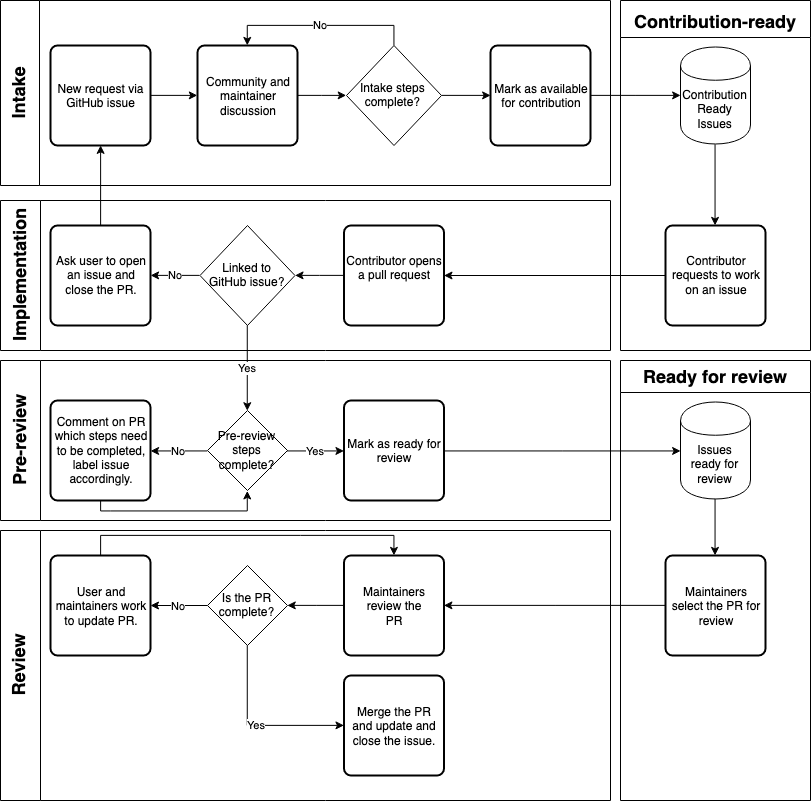

# AWS CLI Contributing Guide

Proposal         | Metadata
---------------- | -------------
**Author**       | Kenneth Daily
**Status**       | Proposed
**Created**      | 19-October-2021

## Abstract

This document proposes standards and processes to improve and publish community
expectations for contributions. It defines the process for proposing,
submitting, and reviewing a contribution. This proposal will make it easier for
the community to successfully contribute to the AWS CLI.

## Motivation

As of 2021-11-02, there are 189 pull requests and 465 issues in the AWS CLI
GitHub repository. 52 pull requests and 81 issues have not been updated in more
than a year. This volume indicates that there are motivated users who want to
contribute to the AWS CLI but are unable to do so. Further, it demonstrates that
there are users who have ideas for features but do not see them incorporated.
From the community perspective, the volume of open issues and pull requests
indicates a lack of awareness or communication with the community to respond to
their needs.

### Goals

The approach for customer contributions should satisfy the following goals:

1. Users should know how they can help. It should be straightforward for
   community members to make high quality contributions.
1. We should prioritize the things that people want based on feedback they
   provide on issues. Users should know how to provide that feedback.
1. Users should know exactly what to expect when interacting with the
   maintainers. The next steps should be clearly defined.
1. A contribution should be completed through the efforts of the contributor and
   maintainers and not be left abandoned. The maintainers are responsible see it
   through to a conclusion.
1. No requests should exist without a response. Communication from maintainers
   should happen in a timely manner, even (especially!) if that’s saying no. An
   initial response to open PRs should occur within [TBD] business days.

### Motivating Examples

#### Limited information on where and what to contribute

The AWS CLI currently has code, documentation, and examples published publicly
on a number of GitHub repositories. We have hundreds of open issues and pull
requests across these areas. However, we do not have a guide for users to know
what things are available for them to contribute on or what the process or
guidelines are. We get frequent requests to contribute on specific issues, but
it's a significant effort to respond to these requests individually. We also do
not have guidance for which kinds of issues we do not accept contributions,
leading to users to spend effort that ultimately will not be used. For example,
users often request waiters and paginators, which are now standardized across
AWS SDKs and implemented by the service teams, who know how their APIs work to
provide the best performance and experience.

We need a well-documented guide and process for the community to know what is
available to work (and what is not) on so that their efforts are used
effectively. This would help users and maintainers focus on relevant issues and
work more effectively.

#### No active triage or first response

`aws-cli` [pull request 3174](https://github.com/aws/aws-cli/pull/3174) adds MFA
functionality to support cache usage. It is the pull request with the most 👍🏻
reactions (55) since being opened in March 2018. It was proposed as an
[issue](https://github.com/aws/aws-cli/issues/3172), which was subsequently
closed to not have both a PR and an issue open. No comments from AWS have been
made since the issue was closed. It is still getting comments noting the need as
of April 2021. It currently would need rebasing since it has conflicts with the
base branch. It would also need cross-SDK review since it involves credential
behavior. This issue demonstrates the lack of response to high user request
issues that impact cross-SDK features and a lack of process to make changes.

We need to prioritize triage and review of community contributions in a timely
manner. The steps that community members should use to make their contribution
should be communicated clearly and be straightforward to follow.

#### Unprioritized contributions

Some pull requests have had initial contact from maintainers as desirable
changes, but then fall off the radar and remain unprioritized. This leaves the
impression that user requests are not a priority. For example, [pull request
2105](https://github.com/aws/aws-cli/pull/2105) makes S3 sync command excludes
files more efficiently. It proposes to fix issue
[#1138](https://github.com/aws/aws-cli/issues/1138) that had tacit approval from
the maintainers. It was subsequently left uncompleted by the original author,
but picked up by another community member and improved in a related [pull
request](https://github.com/aws/aws-cli/pull/5425). No further interaction from
the maintainers has occurred.

The current review process is very *ad hoc*. The AWS CLI team has limited
bandwidth and competing priorities; without well-defined next steps for the
maintainers, these types of requests are then the first to be neglected for
prioritization. A community contribution should not be left in an incomplete
state or waiting on a maintainer; it should be resolved by merging it or closing
it. When an issue is raised and reviewed, we need to prioritize it and see it
through.

#### Pull requests with limited background and context

Many pull requests come as unsolicited changes that often do not correspond to
an open issue that has been discussed by the maintainers or the community. They
often end up lingering with no communication from the maintainers to indicate
the feasibility or appropriateness of the changes. As an example, [`aws-cli`
pull request 2636](https://github.com/aws/aws-cli/pull/2636)  adds functionality
to configure MFA. It adds or alters 231 lines of code across five files, and is
a significant new feature. There is no open issue or discussion about the
feature other than on the PR. It has no comments from AWS employees, other than
to indicate that it is a “large” pull request, since 2017. Conversation
continued for a year on the PR by interested users with no other interaction or
guidance from AWS.

A idea that has not been vetted by the community and the maintainers is
difficult to approve; it's hard to have a conversation when it involves an idea
proposal as well as code changes. It usually ends in an unmerged pull request or
significant code revision, which is effort that was unnecessarily expended by
the user and potentially the maintainer. We need a structured process for the
life cycle of an idea that can culminate in a community contribution. We also
need to prioritize issues against other requests from the community given the
effort to contribute for users and review for maintainers.

#### Competing priorities and limited bandwidth

There are 151 open issues that have upvotes or reactions from five or more users,
indicating broader interest. That volume is not tractable for the maintainers to
implement themselves. Community members need to be able to contribute more
easily while balancing the efforts of maintainers to conduct thorough reviews of
code before merging.

We need to collect and review user feedback to decide on what to work on to
determine what contributions are of interest. We need to tell users how they can
provide feedback in the best way for us to take action. We also need to
strategically and fairly manage the amount of in flight work so that open
requests do not pile up.

## Specification

This section defines:

* [Current process](#current-process)
* [Proposed improvements](#proposed-improvements)

### Current Process

Customer feature requests are reviewed for general suitability and uniqueness,
but are not actively commented on by maintainers to move the feature forward to
an implementation. Pull requests are reviewed in an *ad hoc* fashion by various
members of the maintainer team, but similarly are not actively processed to
continue towards acceptance.

### Proposed Improvements

We propose the maintainers will actively engage with the community contributors
to identify suitable implementations for requested features and provide gudiance
during the process. In addition, we will publish a contributing guide that
describes the life cycle of a feature request that can culminate in a code
contribution from the community through a GitHub pull request. The guide
describes the triage and review of open feature requests with the goal of
identifying issues where community contributions would be welcome. It defines
what is required to move a feature request to be available for community
contribution. It documents the review process and sets community expectations
around communications to move a contribution forward.

At a high level, the process would be:

1. Review GitHub issues to determine that enough background, description, use
   cases, and impact exists to implement a feature.
1. Once enough information is available and a general implementation idea is
   agreed on, identify which issues are available for the community to
   contribute.
1. When an issue is being worked on by the community, provide guidance and
   support during the contribution process.
1. When requested, review a pull request and make a decision if it can be
   included or more work is needed.
1. Engage with the community during discussion of implementation details or
   issues that arise during the contribution.
1. Merge in and acknowledge a contribution from the community.

See [Appendix A](#a-appendix-a) for a flow chart of the major steps in the process.

## Rationale/FAQ

### Q. Why do we require issues to be opened instead of just pull requests?

Having a defined process for intake reduces the burden on deciding which way is
the best way. We're taking an opinionated stance that code changes made in
isolation generally do not provide enough context on what problem exists and why
the proposed change is the best way to fix it. Reviewing a pull request also
requires significant effort on the part of maintainers - reading someone elses
code can be an intensive task. Before dedicating that effort, we feel that
having a more general discussion about the problem and solutions will help
reduce the overall effort into code review.

Pull requests are often made for problems that only affect the contributor or a
very small portion of the user base. Requiring an issue provides a mechanism to
request structured feedback in the form of "upvotes" or GitHub reactions to
estimate the impact of the issue on the community.

Logistically, using GitHub issues also centralizes the metadata on what work is
available and ongoing via labels. While pull requests are really GitHub issues
with code changes attached to them, it is difficult to interrogate issues and
pull requests together to gather metrics, check on statuses and assignments, and
perform automated tasks. Having all of the labels and data on a single entity
type reduces the burden on maintaining the system.
 
We do not intend this to be a gatekeeping or pointless task. If a user does open
a pull request without an issue, we will use the opportunity to educate them
about our process, and when necessary assist them in opening an issue. We can
also open the issue ourselves on behalf of the user as well.

### Q: What do we do if a user requests a feature or change that would involve a major change in the way the SDK currently works?

There are times when a change warrants an even more intentional and structured
process before introducing a change. For example, a recent proposal for a source
distribution method for the AWS CLI was made. Before implementation was
finalized, the proposal was made public for open comments and to get feedback
that the approach would solve the problems that exist. The change was a major
deviation from how the AWS CLI works currently, and it was felt that having a
formalized process for this change would result in better decisions.

In this case, we would use the same format as this document for a proposal that
would be opened opened for public comment and review. The document would be
incorporated into the codebase as an accepted proposal as a matter of record.

#### Why should there be a minimum number of upvotes or reactions to open something for the community to work on?

We propose that in order for the maintainers to engage in the code review
process, an issue should have at least five upvotes as evidence of having
significant customer impact. This is intended to prevent narrowly scoped changes
that only affect a single user. It also helps to limit the number of in flight
reviews that the maintainers need to be engaged on, as there is not an unlimited
amount of bandwidth to devote to this task.

At present, there are more than 140 open feature requests and 5 bugs in the AWS
CLI GitHub repository that meet this criteria. We can use the current reactions
to review the backlog and identify issues that we feel would be suited for
community contributions. This process can then inform us how to handle new
issues that might be candidates for community contribution.

#### Q. What is out of scope for changes that we would accept implementations from the community?

There are parts of the codebase that are not suitable for community
contributions. They may pose a security risk, be part of the code that is
dynamically generated, or may require interaction with internal teams to
implement. These include (but are not limited to):

1. Changes to build processes. Some of our build processes are available through
   GitHub, but some are not. We need to carefully test any potential changes to
   be sure that they are compatible with all of our systems.
1. GitHub Actions. Changes to our actions need to be made and reviewed with
   extra scrutiny for security purposes.
1. Changes to models, including waiters, paginators, and resources. These
   requests are cross-SDK and managed by service teams so that all SDKs can use
   them with uniform behavior.
1. Changes to configuration or credential files or processes. These changes can
   also affect the behavior in other SDKs and must thus be made in coordination
   with internal teams.

#### Q. What is automated review, and what is human review?

Initially, most of the  will be human review besides code linting and testing.
Automation will be implemented for issue labeling, state transitions, and
template checks. We currently perform these types of processes for issues, and
the proposed process is agnostic to how it's implemented.

## Appendix

### A. Appendix A

Flow chart of the contribution review process.

